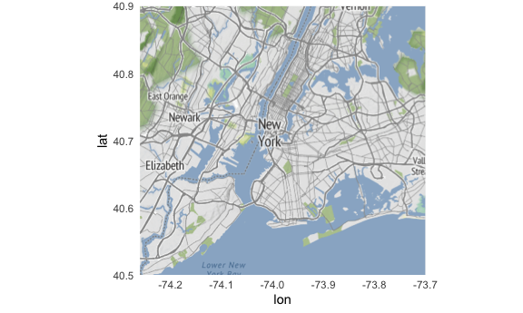
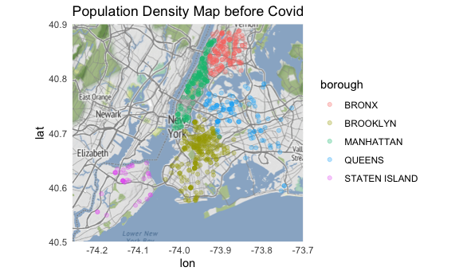
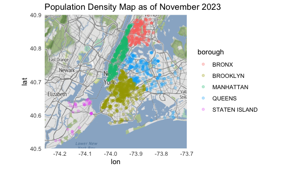
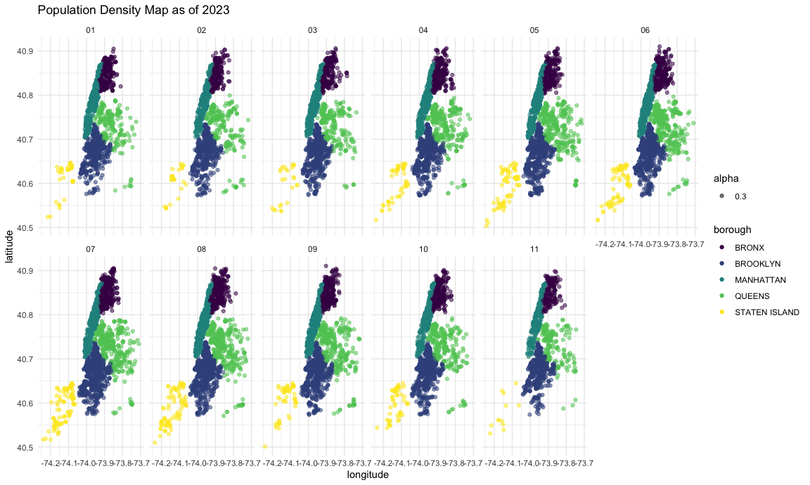

P8105 Final Project
================

``` r
library(tidyverse)
```

    ## ── Attaching core tidyverse packages ──────────────────────── tidyverse 2.0.0 ──
    ## ✔ dplyr     1.1.3     ✔ readr     2.1.4
    ## ✔ forcats   1.0.0     ✔ stringr   1.5.0
    ## ✔ ggplot2   3.4.3     ✔ tibble    3.2.1
    ## ✔ lubridate 1.9.3     ✔ tidyr     1.3.0
    ## ✔ purrr     1.0.2     
    ## ── Conflicts ────────────────────────────────────────── tidyverse_conflicts() ──
    ## ✖ dplyr::filter() masks stats::filter()
    ## ✖ dplyr::lag()    masks stats::lag()
    ## ℹ Use the conflicted package (<http://conflicted.r-lib.org/>) to force all conflicts to become errors

``` r
library(patchwork)
library(ggplot2)
library(ggmap)
```

    ## ℹ Google's Terms of Service: <https://mapsplatform.google.com>
    ##   Stadia Maps' Terms of Service: <https://stadiamaps.com/terms-of-service/>
    ##   OpenStreetMap's Tile Usage Policy: <https://operations.osmfoundation.org/policies/tiles/>
    ## ℹ Please cite ggmap if you use it! Use `citation("ggmap")` for details.

``` r
library(osmdata)
```

    ## Data (c) OpenStreetMap contributors, ODbL 1.0. https://www.openstreetmap.org/copyright

``` r
knitr::opts_chunk$set(
  echo = TRUE,
  fig.width = 6,
  fig.asp = 0.6,
  out.width = "90%"
)

theme_set(theme_minimal() + theme(legend.position = "bottom"))

options(
  ggplot2.continuous.colour = "viridis",
  ggplot2.continuous.fill = "viridis"
)

scale_colour_discrete = scale_color_viridis_d
scale_fill_discrete = scale_fill_viridis_d
```

Preliminary data import and cleaning:

``` r
rats_df = 
  read_csv("./data/rat_sightings.csv") %>% 
  janitor::clean_names() %>% 
  select(unique_key, created_date, location_type, incident_zip, city, borough, latitude, longitude, location) %>% 
  separate(created_date, into = c("created_date", "time"), sep = " ") %>% 
  separate(created_date, into = c("month", "day", "year"), sep = "/")
```

    ## Rows: 232417 Columns: 38
    ## ── Column specification ────────────────────────────────────────────────────────
    ## Delimiter: ","
    ## chr (26): Created Date, Closed Date, Agency, Agency Name, Complaint Type, De...
    ## dbl  (5): Unique Key, X Coordinate (State Plane), Y Coordinate (State Plane)...
    ## lgl  (7): Vehicle Type, Taxi Company Borough, Taxi Pick Up Location, Bridge ...
    ## 
    ## ℹ Use `spec()` to retrieve the full column specification for this data.
    ## ℹ Specify the column types or set `show_col_types = FALSE` to quiet this message.

    ## Warning: Expected 2 pieces. Additional pieces discarded in 232417 rows [1, 2, 3, 4, 5,
    ## 6, 7, 8, 9, 10, 11, 12, 13, 14, 15, 16, 17, 18, 19, 20, ...].

## Making the density map

``` r
head(rats_df)
```

    ## # A tibble: 6 × 12
    ##   unique_key month day   year  time     location_type incident_zip city  borough
    ##        <dbl> <chr> <chr> <chr> <chr>    <chr>         <chr>        <chr> <chr>  
    ## 1   56242499 12    13    2022  06:52:10 3+ Family Ap… 10472        BRONX BRONX  
    ## 2   56242808 12    13    2022  02:28:55 Other (Expla… 10025        NEW … MANHAT…
    ## 3   57383018 04    21    2023  10:03:11 3+ Family Ap… 10026        NEW … MANHAT…
    ## 4   58545179 08    18    2023  03:37:48 1-2 Family D… 11222        BROO… BROOKL…
    ## 5   56610428 01    24    2023  11:45:24 Other (Expla… 11204        BROO… BROOKL…
    ## 6   58788175 09    11    2023  11:52:46 3+ Family Ap… 11238        BROO… BROOKL…
    ## # ℹ 3 more variables: latitude <dbl>, longitude <dbl>, location <chr>

``` r
nyc_map <- get_stadiamap(bbox = c(left = -74.26, bottom = 40.5, right = -73.7, top = 40.9),zoom=10)
```

    ## ℹ © Stadia Maps © Stamen Design © OpenMapTiles © OpenStreetMap contributors.

``` r
ggmap(nyc_map)
```



``` r
rats_march=rats_df|>
  filter(month %in% "01", 
         year%in% "2023")|>
  filter(borough != "Unspecified")

ggmap(nyc_map)+
geom_point(aes(x=longitude,y=latitude,color=borough),alpha=0.3,data=rats_march)+
  theme_minimal() +
  labs(title = "Population Density Map as of March 2023")
```

    ## Warning: Removed 5 rows containing missing values (`geom_point()`).



``` r
rats_november=rats_df|>
  filter(month %in% "11", 
         year%in% "2023")|>
  filter(borough != "Unspecified")

ggmap(nyc_map)+
geom_point(aes(x=longitude,y=latitude,color=borough),alpha=0.3,data=rats_march)+
  theme_minimal() +
  labs(title = "Population Density Map as of November 2023")
```

    ## Warning: Removed 5 rows containing missing values (`geom_point()`).



``` r
rats_2023=rats_df|>
  filter(year %in% "2023")|>
  drop_na()|>
  ggplot(aes(x=longitude,y=latitude))+
  theme_minimal() +
  labs(title = "Population Density Map as of 2023")+
  geom_point(aes(color=borough,alpha=0.3))+
  facet_wrap(~ month, scales = "fixed", ncol = 6)
  
rats_2023
```



## Regression analyses

``` r
rats_df
```

    ## # A tibble: 232,417 × 12
    ##    unique_key month day   year  time    location_type incident_zip city  borough
    ##         <dbl> <chr> <chr> <chr> <chr>   <chr>         <chr>        <chr> <chr>  
    ##  1   56242499 12    13    2022  06:52:… 3+ Family Ap… 10472        BRONX BRONX  
    ##  2   56242808 12    13    2022  02:28:… Other (Expla… 10025        NEW … MANHAT…
    ##  3   57383018 04    21    2023  10:03:… 3+ Family Ap… 10026        NEW … MANHAT…
    ##  4   58545179 08    18    2023  03:37:… 1-2 Family D… 11222        BROO… BROOKL…
    ##  5   56610428 01    24    2023  11:45:… Other (Expla… 11204        BROO… BROOKL…
    ##  6   58788175 09    11    2023  11:52:… 3+ Family Ap… 11238        BROO… BROOKL…
    ##  7   56244873 12    13    2022  01:16:… 3+ Family Ap… 10451        BRONX BRONX  
    ##  8   58637446 08    27    2023  06:24:… 3+ Family Ap… 11211        BROO… BROOKL…
    ##  9   58856599 09    19    2023  01:20:… 1-2 Family D… 11203        BROO… BROOKL…
    ## 10   58051801 06    30    2023  10:22:… Other (Expla… 11222        BROO… BROOKL…
    ## # ℹ 232,407 more rows
    ## # ℹ 3 more variables: latitude <dbl>, longitude <dbl>, location <chr>
