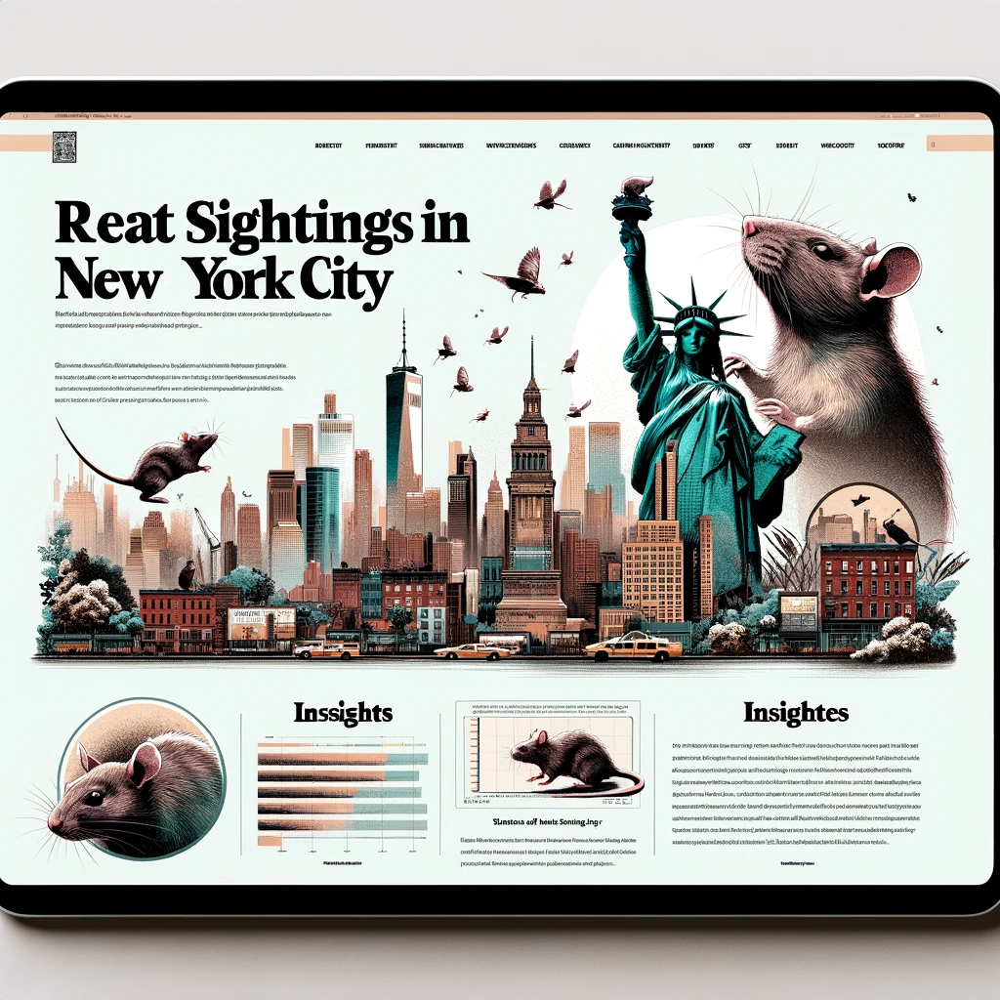

<link href="https://fonts.googleapis.com/css?family=Roboto" rel="stylesheet">

<style>
body {
  font-size: 16px;
  font-family: 'Roboto', sans-serif;
  line-height: 2.0;
}

p::first-letter {
  font-size: 150%;
  font-weight: bold;
  color: #add8e6;
}
</style>


Do the Rats Run This City?: An Investigation into Prevalence of Rat Sightings in New York City


# Screencast
```{r echo = FALSE}
vembedr::embed_url("https://youtu.be/yh7b4Dq--mA")
```


# Project motivation
New York City is known for its rampant rat problem. Tourists and resident alike shriek at the sight of rats in trash cans, rats in the subway stations, rats on the sidewalk, rats in parks, rats in restaurants, rats carrying pizza in their mouths, and the dreaded rat in your apartment. But we want to know: are all boroughs and neighborhoods created equal when it comes to these scurrying critters? Where are these skittering vermin most likely to make their homes? Another dimension to our project will involve the Rat Czar of New York City, a recently appointed position created to manage the rat problem. Since assuming office, has the Rat Czar made a difference in rat sightings? Also, we want to explore if human density impacts rat density – for example, did the COVID-19 pandemic impact rat sightings?

# Anticipated data sources
This [Rat Sighting's](https://data.cityofnewyork.us/Social-Services/Rat-Sightings/3q43-55fe ) data includes all the rat sightings reported to 311 from 2010 to now (updated daily). Each incident includes the borough, location type, the longitude and latitude, and more.

# Uncover the Hidden Dynamics of Urban Wildlife: A Visual Exploration of Rat Populations
Dive into an intriguing visual narrative that uncovers the shifting landscapes of urban wildlife, particularly focusing on rat populations. Our meticulously designed [Maps](final_project.html) offer a unique perspective on how these adaptable creatures have responded to global changes, especially during and after the COVID-19 pandemic. 


These maps provide fascinating insights into the resilience and adaptability of urban wildlife in the face of global challenges and changing human landscapes.

Embark on this captivating journey by visiting our specially curated [subpage](final_project.html). Witness firsthand the impact of environmental and societal changes on urban animal populations. Your exploration into the intriguing world of urban ecology starts here.

# Explore the Intriguing World of Urban Wildlife Through Data: Rat Sightings in Focus
In our dedicated ["Graphs and visualizations on the data"](finalproject_graphs.html) section, delve into an enlightening series of graphs and visualizations that bring to light the fascinating dynamics of rat populations in urban settings. Our data-driven approach provides a detailed look at how rat sightings have changed over time, especially with the introduction of the Rat Czar office.

Join us in this [data-driven exploration](finalproject_graphs.html) and gain a new perspective on the often unseen but vital aspects of urban ecosystems. Discover the story behind the numbers and understand the complexities of managing urban wildlife.

# Delve into the Depths of Data: Unraveling the Impacts of Rat Czar and COVID-19 through Regression Analysis

In our comprehensive [Regression Analysis](regression_final.html) section, we take a deep dive into the statistical exploration of urban rat populations, focusing on two significant events: the appointment of the Rat Czar and the COVID-19 pandemic. Our analysis provides a robust, data-driven understanding of their effects.

This section is aimed at providing a nuanced understanding of how strategic decisions and global events influence urban wildlife, particularly rat populations. Our rigorous statistical approach ensures that the insights drawn are both accurate and reliable.

Embark on this [analytical](regression_final.html) journey with us to understand the complexities of urban ecology and wildlife management in the face of changing global and local landscapes.

# Discover New York City's Unseen Inhabitants: Exclusive Report on Rat Sightings

New York City, a bustling metropolis known for its iconic landmarks, is also home to an often overlooked but significant population – urban rats. In our latest [Report](final-project-report.html), now featured on a dedicated subpage, we delve into the world of these resilient city dwellers, offering a unique perspective on their presence across the five boroughs.

Our [Report](final-project-report.html), based on extensive data from NYC Open Data, explores where most rat sightings occur and evaluates the impact of major events and initiatives like the COVID-19 pandemic and the Rat Czar appointment. From Times Square to the Statue of Liberty, rats have become an unofficial mascot of the city, and our study aims to understand their patterns and significance.



Whether you're a New Yorker, a visitor, or just curious about urban wildlife, our report offers fascinating insights. It's not just about understanding where these creatures are most prevalent; it's about comprehending their impact on our daily lives and urban infrastructure.

Embark on this revealing journey by visiting our [subpage](final-project-report.html). See New York City through a different lens and grasp the complexities of coexisting with our urban wildlife.

# Our GitHub
Thank you for visiting our webpage! We are committed to offering valuable content and resources to enhance your experience. Should you wish to explore our projects further, we invite you to visit our GitHub page. On our GitHub page, you'll discover the latest updates on our projects, access to source codes, and various opportunities to engage with our vibrant community.
Click this link for direct access: [Our GitHub page.](https://github.com/cdai18/p8105_final_project.git)


# Our Team

- Brady Pham,[](https://https://github.com/bradford-pham), [](mailto:bp2678@cumc.columbia.edu)
- Christina Dai, [](https://https://github.com/cdai18), [](mailto:cd3347@cumc.columbia.edu)
- Congrui Zhang, [](https://github.com/BigBadApp1e), [](mailto:cz2750@cumc.columbia.edu)
- Qiran Chen, [](https://github.com/qc2336), [](mailto:qc2336@cumc.columbia.edu)
- Zihan Wu, [](https://github.com/zw2974), [](mailto:zw2974@cumc.columbia.edu)
