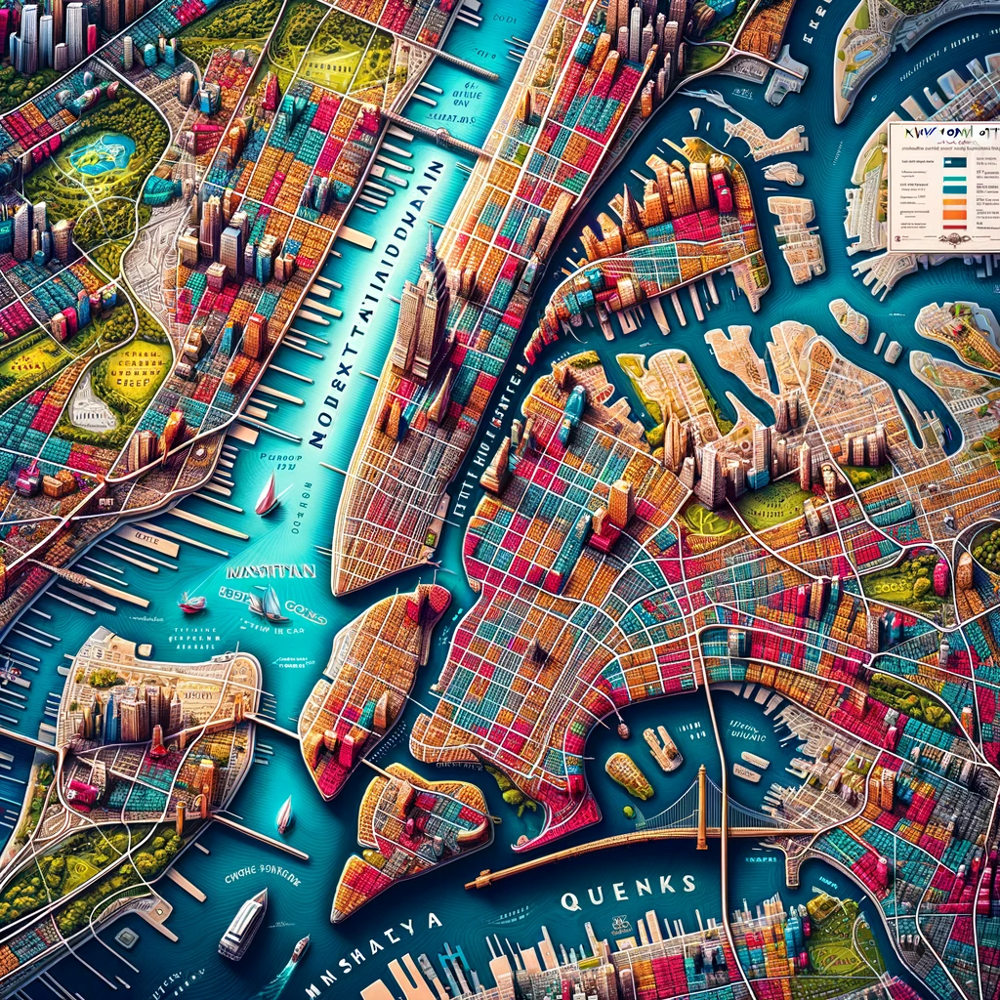

<link href="https://fonts.googleapis.com/css?family=Roboto" rel="stylesheet">

Do the Rats Run This City?: An Investigation into Prevalence of Rat Sightings in New York City

# Project motivation
New York City is known for its rampant rat problem. Tourists and resident alike shriek at the sight of rats in trash cans, rats in the subway stations, rats on the sidewalk, rats in parks, rats in restaurants, rats carrying pizza in their mouths, and the dreaded rat in your apartment. But we want to know: are all boroughs and neighborhoods created equal when it comes to these scurrying critters? Where are these skittering vermin most likely to make their homes? Another dimension to our project will involve the Rat Czar of New York City, a recently appointed position created to manage the rat problem. Since assuming office, has the Rat Czar made a difference in rat sightings? Also, we want to explore if human density impacts rat density – for example, did the COVID-19 pandemic impact rat sightings?

# Anticipated data sources
This [Rat Sighting's](https://data.cityofnewyork.us/Social-Services/Rat-Sightings/3q43-55fe ) data includes all the rat sightings reported to 311 from 2010 to now (updated daily). Each incident includes the borough, location type, the longitude and latitude, and more.

# Map

[Map](final_project.html)

# Graphs and visualizations on the data
[Graphs and visualizations on the data](finalproject_graphs.html)

# Regression

[Regression Analysis](regression_final.html)

# Our Report

[Report](final-project-report.html)

# Our GitHub
Thank you for visiting our webpage! We are committed to offering valuable content and resources to enhance your experience. Should you wish to explore our projects further, we invite you to visit our GitHub page. On our GitHub page, you'll discover the latest updates on our projects, access to source codes, and various opportunities to engage with our vibrant community.
Click this link for direct access: [Our GitHub page.](https://github.com/cdai18/p8105_final_project.git)

# Our Team

- Brady Pham,, 
- Christina Dai, , 
- Congrui Zhang, , 
- Qiran Chen, , 
- Zihan Wu, , 
