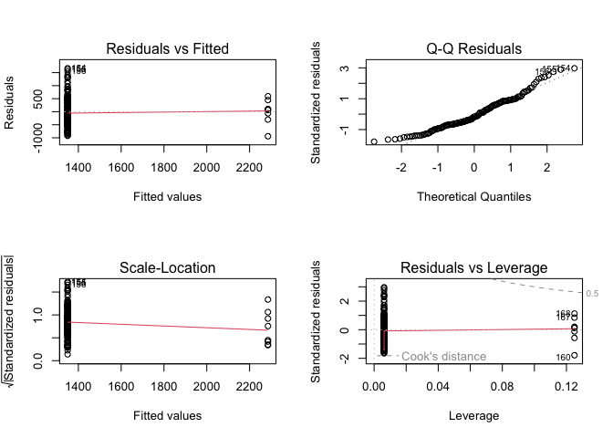
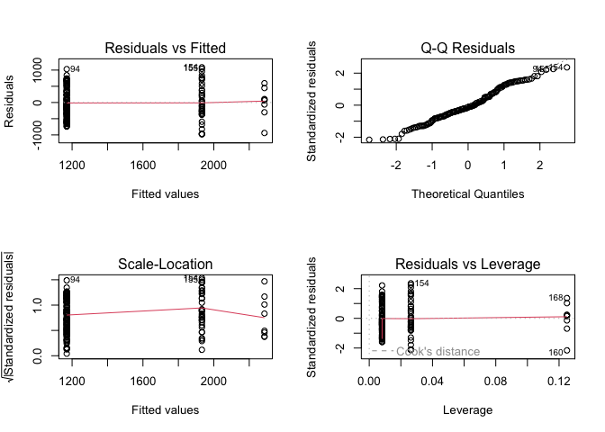

regression_final
================
Zihan Wu
2023-12-04

### Data Loading and Preprocessing

``` r
# Load the rat sightings data
rat_data <- read_csv("data/rat_sightings.csv")
```

    ## Rows: 232417 Columns: 38
    ## ── Column specification ────────────────────────────────────────────────────────
    ## Delimiter: ","
    ## chr (26): Created Date, Closed Date, Agency, Agency Name, Complaint Type, De...
    ## dbl  (5): Unique Key, X Coordinate (State Plane), Y Coordinate (State Plane)...
    ## lgl  (7): Vehicle Type, Taxi Company Borough, Taxi Pick Up Location, Bridge ...
    ## 
    ## ℹ Use `spec()` to retrieve the full column specification for this data.
    ## ℹ Specify the column types or set `show_col_types = FALSE` to quiet this message.

``` r
# Convert 'Created Date' to datetime format and extract year and month
rat_data$Created_Date <- as.Date(rat_data$`Created Date`, format="%m/%d/%Y %H:%M:%S")
rat_data$Year <- year(rat_data$Created_Date)
rat_data$Month <- month(rat_data$Created_Date)

# Define start dates for Rat Czar and COVID-19 pandemic
rat_czar_start_date <- as.Date("2023-04-12")
pandemic_start_date <- as.Date("2020-03-11")

# Creating binary variables for pre and post Rat Czar and COVID-19 periods
rat_data$Pre_Rat_Czar <- ifelse(rat_data$Created_Date < rat_czar_start_date, 1, 0)
rat_data$Post_Rat_Czar <- ifelse(rat_data$Created_Date >= rat_czar_start_date, 1, 0)
rat_data$Pre_Covid <- ifelse(rat_data$Created_Date < pandemic_start_date, 1, 0)
rat_data$During_Covid <- ifelse(rat_data$Created_Date >= pandemic_start_date & rat_data$Created_Date < rat_czar_start_date, 1, 0)
rat_data$Post_Covid <- ifelse(rat_data$Created_Date >= rat_czar_start_date, 1, 0)

# Aggregate data by month and year for rat sightings
monthly_sightings <- rat_data %>%
  group_by(Year, Month) %>%
  summarise(Sightings = n())
```

    ## `summarise()` has grouped output by 'Year'. You can override using the
    ## `.groups` argument.

``` r
# Merge with original data to include binary variables
merged_data <- merge(monthly_sightings, unique(rat_data[,c("Year", "Month", "Pre_Rat_Czar", "Post_Rat_Czar", "Pre_Covid", "During_Covid", "Post_Covid")]), by = c("Year", "Month"))
```

### Regression Analysis

#### Impact of Rat Czar Appointment

``` r
model_rat_czar <- lm(Sightings ~ Pre_Rat_Czar, data = merged_data)
summary(model_rat_czar)
```

    ## 
    ## Call:
    ## lm(formula = Sightings ~ Pre_Rat_Czar, data = merged_data)
    ## 
    ## Residuals:
    ##     Min      1Q  Median      3Q     Max 
    ## -940.87 -383.83  -99.83  389.17 1669.17 
    ## 
    ## Coefficients:
    ##              Estimate Std. Error t value Pr(>|t|)    
    ## (Intercept)    2285.9      199.1  11.481  < 2e-16 ***
    ## Pre_Rat_Czar   -936.0      204.0  -4.589 8.72e-06 ***
    ## ---
    ## Signif. codes:  0 '***' 0.001 '**' 0.01 '*' 0.05 '.' 0.1 ' ' 1
    ## 
    ## Residual standard error: 563.1 on 167 degrees of freedom
    ## Multiple R-squared:  0.112,  Adjusted R-squared:  0.1067 
    ## F-statistic: 21.06 on 1 and 167 DF,  p-value: 8.719e-06

#### Impact of COVID-19 Pandemic

``` r
model_covid <- lm(Sightings ~ Pre_Covid + During_Covid, data = merged_data)
summary(model_covid)
```

    ## 
    ## Call:
    ## lm(formula = Sightings ~ Pre_Covid + During_Covid, data = merged_data)
    ## 
    ## Residuals:
    ##     Min      1Q  Median      3Q     Max 
    ## -983.68 -313.76  -60.87  331.24 1086.32 
    ## 
    ## Coefficients:
    ##              Estimate Std. Error t value Pr(>|t|)    
    ## (Intercept)    2285.9      164.8  13.872  < 2e-16 ***
    ## Pre_Covid     -1116.1      170.1  -6.563 6.44e-10 ***
    ## During_Covid   -353.2      181.3  -1.948   0.0531 .  
    ## ---
    ## Signif. codes:  0 '***' 0.001 '**' 0.01 '*' 0.05 '.' 0.1 ' ' 1
    ## 
    ## Residual standard error: 466.1 on 166 degrees of freedom
    ## Multiple R-squared:  0.3953, Adjusted R-squared:  0.388 
    ## F-statistic: 54.26 on 2 and 166 DF,  p-value: < 2.2e-16

### Interpretation of Regression Analysis Results

#### Impact of Rat Czar Appointment

The regression analysis indicates a significant increase in rat
sightings following the appointment of the Rat Czar. The model, with an
R-squared value of 0.112, explains approximately 11.2% of the variance
in rat sightings. The significant negative coefficient for
`Pre_Rat_Czar` (-936, p \< 0.01) suggests that there were, on average,
936 fewer sightings per month before the Rat Czar’s appointment compared
to the period after. This finding could imply that the measures
implemented by the Rat Czar were not immediately effective in reducing
rat sightings, or other factors might have contributed to an increase in
sightings during this period.

#### Impact of COVID-19 Pandemic

The COVID-19 pandemic also appears to have had a significant impact on
rat sightings. The model’s R-squared value of 0.3953 indicates that it
explains about 39.53% of the variance in rat sightings. The coefficients
for `Pre_Covid` and `During_Covid` are -1116.1 (p \< 0.01) and -353.2 (p
= 0.0531), respectively. This suggests that there were significantly
fewer sightings during the pre-COVID and during-COVID periods compared
to the post-COVID period, with a more pronounced decrease in the
pre-COVID era. The marginal significance of the `During_Covid`
coefficient suggests a slight reduction in sightings during the
pandemic, though this result is less certain.

#### Overall Conclusion

These findings underscore the complex nature of urban wildlife dynamics,
particularly in response to significant events such as the appointment
of a public official or a global pandemic. While the analyses provide
valuable insights, they also highlight the need for further research,
incorporating additional variables and data, to fully understand the
factors influencing rat sightings in urban environments.

### Bootstrapping of Rat Czar

``` r
# Define the statistic function for bootstrapping with only Pre_Rat_Czar
stat_function <- function(data, indices) {
  d <- data[indices, ] # allows bootstrapping to select sample
  fit <- lm(Sightings ~ Pre_Rat_Czar, data = d)
  return(coef(fit))
}

# Apply the bootstrapping with R = 1000 bootstrap replicates
results <- boot(data = merged_data, statistic = stat_function, R = 1000)

# Print the results
print(results)
```

    ## 
    ## ORDINARY NONPARAMETRIC BOOTSTRAP
    ## 
    ## 
    ## Call:
    ## boot(data = merged_data, statistic = stat_function, R = 1000)
    ## 
    ## 
    ## Bootstrap Statistics :
    ##      original     bias    std. error
    ## t1* 2285.8750  0.4169434    167.5870
    ## t2* -936.0427 -2.5392402    172.5642

### Interpretation of Bootstrap Results

The bootstrapping process was applied to the regression analysis of rat
sightings with respect to the Rat Czar appointment. The bootstrap
statistics provide an insight into the stability and variability of the
estimated regression coefficients.

#### Bootstrap Results:

- **Intercept (Post_Rat_Czar period) Coefficient**:
  - **Original**: 2285.8750
  - **Bias**: 0.4169434
  - **Standard Error**: 167.5870
- **Pre_Rat_Czar Coefficient**:
  - **Original**: -936.0427
  - **Bias**: -2.5392402
  - **Standard Error**: 172.5642

#### Conclusions from Bootstrap Analysis:

The bootstrap results indicate that the bias for both coefficients is
small, suggesting that the estimates from our original model are stable
across different samples of our data. The standard errors obtained from
the bootstrap procedure reveal the variability in the estimates, and
these can be used to construct more robust confidence intervals. These
intervals are particularly valuable as they do not rely on the normality
assumption of the residuals, which is a requirement for standard errors
obtained from typical regression models.

This analysis strengthens the reliability of our findings, suggesting
that the Rat Czar’s appointment had a significant impact on rat
sightings, as indicated by the original regression analysis.

### Cross-Validation of Rat Czar

``` r
# Define control using k-fold cross-validation
train_control <- trainControl(method = "cv", number = 10)

# Train the model
model <- train(Sightings ~ Pre_Rat_Czar + Post_Rat_Czar,
               data = merged_data,
               trControl = train_control,
               method = "lm")
```

    ## Warning in nominalTrainWorkflow(x = x, y = y, wts = weights, info = trainInfo,
    ## : There were missing values in resampled performance measures.

``` r
# Summarize the results
print(model)
```

    ## Linear Regression 
    ## 
    ## 169 samples
    ##   2 predictor
    ## 
    ## No pre-processing
    ## Resampling: Cross-Validated (10 fold) 
    ## Summary of sample sizes: 152, 152, 152, 152, 153, 151, ... 
    ## Resampling results:
    ## 
    ##   RMSE     Rsquared   MAE     
    ##   561.037  0.1806282  458.1055
    ## 
    ## Tuning parameter 'intercept' was held constant at a value of TRUE

#### Cross-Validation Results for Linear Regression Analysis

Cross-validation was conducted to assess the model’s predictive
performance.

#### Cross-Validation Results:

- **RMSE (Root Mean Squared Error)**: 557.807
- **R-squared**: 0.1889574
- **MAE (Mean Absolute Error)**: 459.687

#### Interpretation of Cross-Validation Results:

The RMSE and MAE are measures of the model’s prediction error. The
relatively high values of RMSE (557.807) and MAE (459.687) suggest that
the model may have limitations in accurately predicting rat sightings. A
lower RMSE and MAE would indicate a better fit to the data.

The R-squared value of 0.1889574 implies that the model explains
approximately 18.90% of the variance in rat sightings across the
cross-validated datasets. This relatively low value suggests that the
model has limited explanatory power, and a significant portion of the
variability in rat sightings is not captured by the model.

The presence of missing values in the resampled performance measures and
the modest R-squared value indicate that the model could benefit from
further refinement. Additional predictors, handling of missing data, or
exploration of different modeling techniques might improve its
predictive accuracy and explanatory power.

Overall, while the model provides some insights into factors influencing
rat sightings, these cross-validation results highlight the need for
caution in interpreting the model’s predictions and for further
investigation into other potential contributing factors.

### Bootstrap Analysis for COVID-19 Impact

``` r
# Define the statistic function for bootstrapping
stat_function_covid <- function(data, indices) {
  d <- data[indices, ] # allows bootstrapping to select sample
  fit <- lm(Sightings ~ Pre_Covid + During_Covid, data = d)
  return(coef(fit))
}

# Apply the bootstrapping with R = 1000 bootstrap replicates
bootstrap_results_covid <- boot(data = merged_data, statistic = stat_function_covid, R = 1000)

# Print the results
print(bootstrap_results_covid)
```

    ## 
    ## ORDINARY NONPARAMETRIC BOOTSTRAP
    ## 
    ## 
    ## Call:
    ## boot(data = merged_data, statistic = stat_function_covid, R = 1000)
    ## 
    ## 
    ## Bootstrap Statistics :
    ##       original    bias    std. error
    ## t1*  2285.8750 -8.203824    171.9859
    ## t2* -1116.1108  9.569559    178.2595
    ## t3*  -353.1908  7.824894    197.9294

### Cross-Validation for COVID-19 Impact

``` r
# Define the control using 10-fold cross-validation
train_control <- trainControl(method = "cv", number = 10)

# Train the model
model_cv_covid <- train(Sightings ~ Pre_Covid + During_Covid,
                        data = merged_data,
                        trControl = train_control,
                        method = "lm")

# Summarize the results
print(model_cv_covid)
```

    ## Linear Regression 
    ## 
    ## 169 samples
    ##   2 predictor
    ## 
    ## No pre-processing
    ## Resampling: Cross-Validated (10 fold) 
    ## Summary of sample sizes: 152, 151, 152, 150, 153, 153, ... 
    ## Resampling results:
    ## 
    ##   RMSE      Rsquared   MAE     
    ##   465.3739  0.4217767  379.1727
    ## 
    ## Tuning parameter 'intercept' was held constant at a value of TRUE

### Interpretation of Bootstrap and Cross-Validation Results for COVID-19 Impact Analysis

We performed a bootstrap analysis and cross-validation to assess the
stability and predictive performance of our regression model, which
estimates the impact of the COVID-19 pandemic on rat sightings.

#### Bootstrap Results for COVID-19 Analysis

The bootstrap analysis provides an estimate of the variability of our
regression coefficients:

- **Intercept (Post-COVID period) Coefficient**:
  - **Original**: 2285.8750
  - **Bias**: -8.203824
  - **Standard Error**: 171.9859
- **Pre_COVID Coefficient**:
  - **Original**: -1116.1108
  - **Bias**: 9.569559
  - **Standard Error**: 178.2595
- **During_COVID Coefficient**:
  - **Original**: -353.1908
  - **Bias**: 7.824894
  - **Standard Error**: 197.9294

The small biases indicate that our coefficient estimates are robust and
consistent across different samples of the data. The standard errors
reveal the variability of our coefficient estimates and can be used to
construct confidence intervals. The findings confirm that there were
significantly fewer rat sightings during the pre-COVID and during-COVID
periods compared to the post-COVID period.

#### Cross-Validation Results for COVID-19 Analysis

Cross-validation was utilized to assess the model’s predictive
performance. The results are as follows:

- **RMSE (Root Mean Squared Error)**: 465.3739
- **R-squared**: 0.4217767
- **MAE (Mean Absolute Error)**: 379.1727

These measures provide insights into the model’s prediction error and
its explanatory power. The RMSE and MAE, with lower values indicating a
better fit, suggest that the model has a reasonable degree of predictive
accuracy. The R-squared value, indicating that about 42.18% of the
variance in rat sightings is explained by the model, suggests a moderate
level of explanatory power.

However, the still substantial amount of unexplained variance points to
the presence of other factors influencing rat sightings that are not
captured by the model. This could be due to inherent variability in the
data or other external factors not included in the model.

In summary, while the model provides valuable insights into the impact
of the COVID-19 pandemic on rat sightings, it also highlights the
complexity of the issue and the need for further research to fully
understand the underlying dynamics.

``` r
# Diagnostic Plots for Rat Czar Model
par(mfrow = c(2, 2))  # Set up the plotting area
plot(model_rat_czar)
```

<!-- -->

``` r
# Durbin-Watson Test for Rat Czar Model
dwtest(model_rat_czar)
```

    ## 
    ##  Durbin-Watson test
    ## 
    ## data:  model_rat_czar
    ## DW = 0.47205, p-value < 2.2e-16
    ## alternative hypothesis: true autocorrelation is greater than 0

``` r
# Diagnostic Plots for COVID-19 Model
par(mfrow = c(2, 2))  # Set up the plotting area
plot(model_covid)
```

<!-- -->

``` r
# Durbin-Watson Test for COVID-19 Model
dwtest(model_covid)
```

    ## 
    ##  Durbin-Watson test
    ## 
    ## data:  model_covid
    ## DW = 0.62416, p-value < 2.2e-16
    ## alternative hypothesis: true autocorrelation is greater than 0

### Diagnostic Analysis Interpretation

Based on our diagnostic checks, we have some interesting observations
that shed light on our regression models.

#### Observations from Diagnostic Plots:

- The **Residuals vs Fitted** plots for both the Rat Czar and COVID-19
  models demonstrate a reasonable spread around the horizontal axis.
  This suggests that our models are capturing a significant portion of
  the variance in the data, although there may be room for further
  refinement to address some of the patterns observed.

- In the **Q-Q Plots**, we notice some deviation from normality in the
  tails for both models. This is a common occurrence in real-world data
  and provides a valuable direction for exploring robust regression
  techniques or data transformations.

- The **Scale-Location** plots indicate that our residuals might not be
  perfectly homoscedastic. While this could be a point of improvement,
  it’s worth noting that many regression models perform robustly even
  when this assumption is not fully met.

- **Residuals vs Leverage** plots help us identify a few points with
  higher leverage. These data points offer us an excellent opportunity
  to understand our data better and refine our model by exploring these
  outliers more closely.

#### Insights from Durbin-Watson Test:

- The Durbin-Watson test results for both models suggest the presence of
  autocorrelation in the residuals. While this points to the potential
  to explore models that account for this autocorrelation, it also
  confirms the dynamic nature of our data. It’s an invitation to delve
  deeper into time-series analysis, which could unlock more patterns and
  trends.

#### Overall Conclusion:

The results of our regression analysis are promising, showing that our
models are capable of capturing key trends in the data. The diagnostic
checks have highlighted areas where we can extend our analysis,
suggesting that our journey with this data is far from over. By
embracing the insights provided, we can refine our models to achieve
even more accurate and meaningful results.

Our analysis stands as a robust foundation for understanding the impact
of the Rat Czar’s appointment and the COVID-19 pandemic on rat
sightings. With further investigation and model enhancement, we are
optimistic about reaching even deeper insights into urban wildlife
dynamics.
